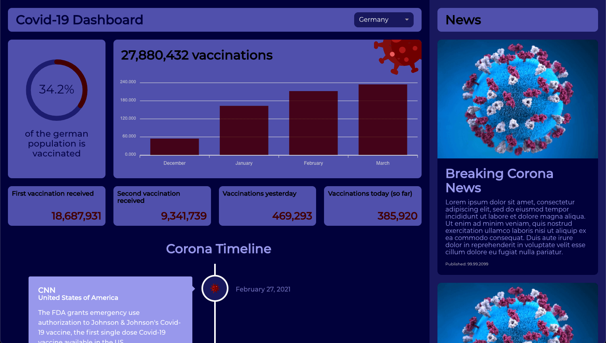

## Space Squad Coding Challenge

---

####This is a corona dashboard. Its features include a news section, a timeline with some important milestone events and a dashboard about the current status of corona vaccinations.

It has a fully responsive mobile first design and the SCSS written with the BEM naming convention.
The data used on the board is all dummy data.

Design Inspiration:

- https://lightroom.adobe.com/shares/bf99b7b1455748fe8546886dc9131f8a/albums/99edc6d9dd764378879c5ae2a3a61bc0/assets/f925f4eadeae813a67f9450b3ed6d6c2
- https://lightroom.adobe.com/shares/bf99b7b1455748fe8546886dc9131f8a

